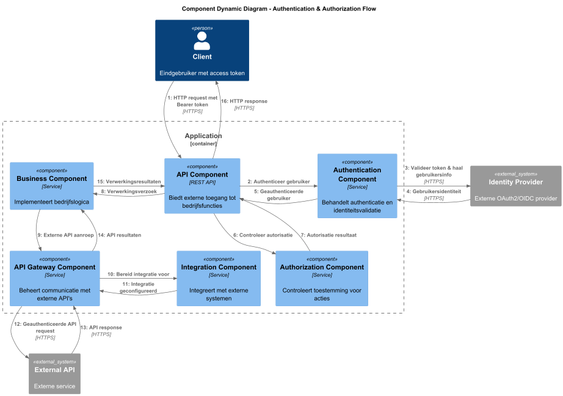

# Ontwerpvraag: authenticatie en autorisatie

Hoe zorg je ervoor dat authenticatie en autorisatie consistent worden toegepast bij het communiceren met verschillende
externe APIs?

## Componenten

> AuthModule
> - Authenticeerd en authorizeerd alle inbound requests op de server

> ExternalApiGateway
> - Beheert de beschikbare APIs en de requests naar de APIs

> RequestInterceptor
> - Onderschept alle outbound requests om de juiste authenticatie en authorizatie gegevens toe te voegen

## Interfaces

> 20 minuten

Het beschrijven van de interfaces van de betrokken componenten (Program to an interface). De uitkomst van deze stap is
een lijst van interfaces met een methoden en een eerste versie van parameters en returnwaarden.

### AuthModule
```java
public interface IdentityProviderClient {
    boolean validateToken(String token);
    UserInfo getUserInfo(String token);
}

public interface AuthService {
    boolean isTokenValid(String token);
    UserPrincipal getCurrentUser();
    Set<String> getCurrentUserRoles();
    boolean hasPermission(String resource, String action);
}

public interface TokenStore {
    void saveUserToken(String userId, AuthToken token);
    AuthToken getUserToken(String userId);
    void removeUserToken(String userId);
    AuthToken getSystemToken(String clientId);
}

interface ApiGateway {
  <T> T callApi(String apiName, ApiRequest request, Class<T> responseType);
}
```

### ExternalApiGateway
```java
interface ApiRequest {
    HttpMethod getMethod();
    String getPath();
    Map<String, String> getQueryParams();
    Object getBody();
}

interface ApiRegistry {
    void registerApi(String apiName, ApiConfig config);
    ApiConfig getApiConfig(String apiName);
}

interface ApiConfig {
    String getBaseUrl();
    AuthType getAuthType();
    int getTimeoutSeconds();
}

enum AuthType {
    SYSTEM_CREDENTIALS,
    FORWARD_USER_TOKEN,
    NONE
}
```

### RequestInterceptor
```java
interface RequestAuthenticator {
    void authenticate(HttpHeaders headers, String apiName, String userToken);
}

interface AuthenticationStrategy {
    void apply(HttpHeaders headers, ApiConfig apiConfig, String userToken);
    boolean supports(AuthType authType);
}
```

## Volgorde



> 30 minuten

Het opdelen van de componenten in een of meerdere classes en/of functies (Open/Closed Principle, Extensibility,
Composition over inheritance, Law of Demeter, Information hiding). De uitkomst is een class diagram met classes en
functies (het code/class level van C4).