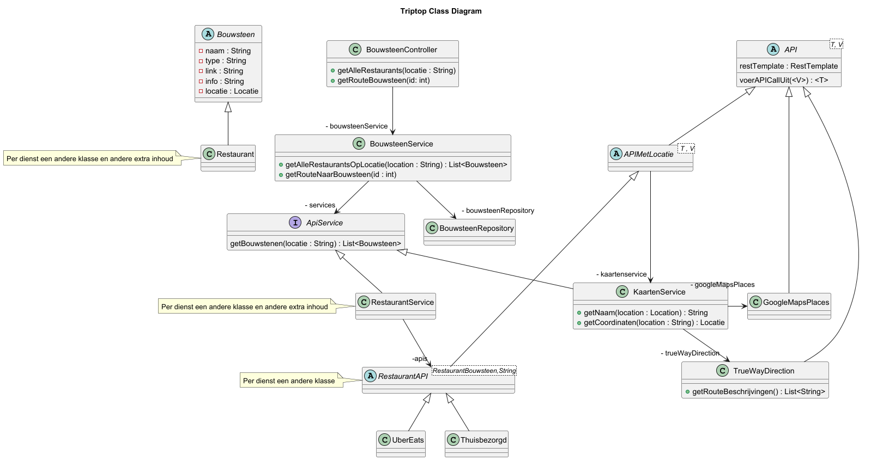
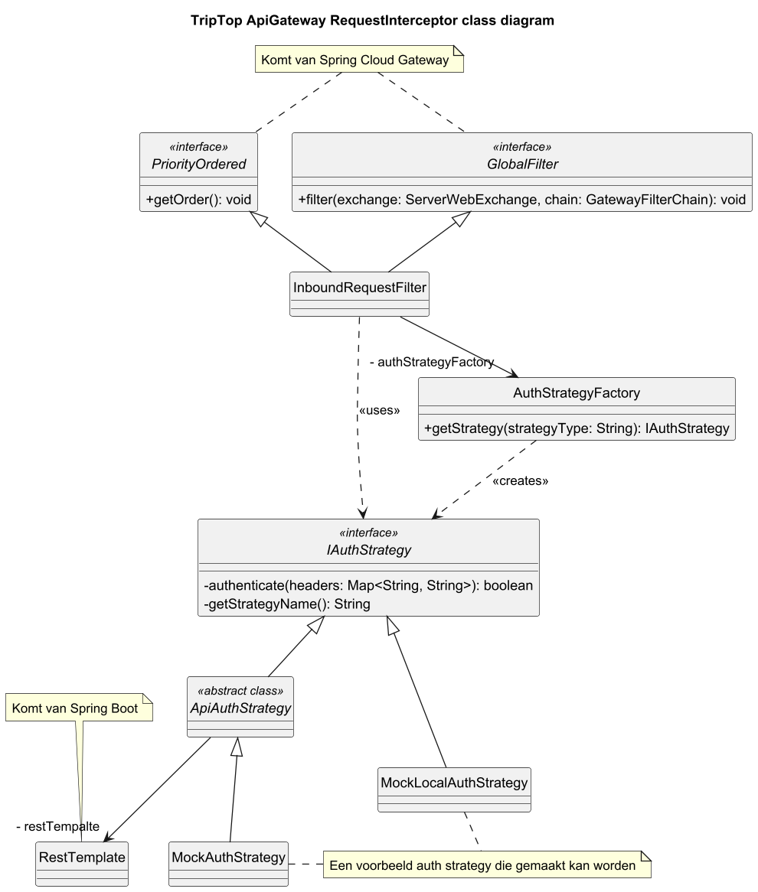
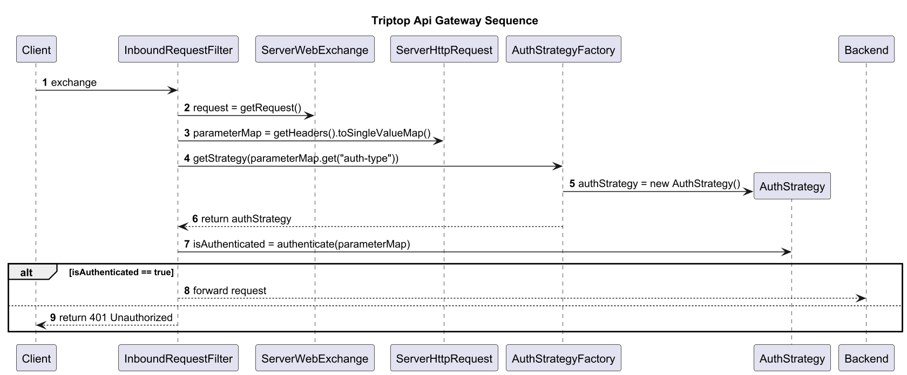

# Software Guidebook Triptop

## 1. Introduction
Dit software guidebook geeft een overzicht van de Triptop-applicatie. Het bevat een samenvatting van het volgende: 
1. De vereisten, beperkingen en principes. 
1. De software-architectuur, met inbegrip van de technologiekeuzes op hoog niveau en de structuur van de software. 
1. De ontwerp- en codebeslissingen die zijn genomen om de software te realiseren.
1. De architectuur van de infrastructuur en hoe de software kan worden geinstalleerd. 

## 2. Context

Het context diagram ziet er als volgt uit:


De gebruiker is een reiziger die een reis wil plannen en boeken. Met de Triptop applicatie kan de reiziger dit doen.
Triptop gebruikt externe API's om informatie over de bouwstenen op te halen.
De Identity Provider zorgt voor authenticatie en autorisatie van de gebruiker op de website.
## 3. Functional Overview

Om de belangrijkste features toe te lichten zijn er user stories en twee domain stories gemaakt en een overzicht van het domein in de vorm van een domeinmodel. Op deze plek staat typisch een user story map maar die ontbreekt in dit voorbeeld.

### 3.1 User Stories

#### 3.1.1 User Story 1: Reis plannen

Als gebruiker wil ik een zelfstandig op basis van diverse variabelen (bouwstenen) een reis kunnen plannen op basis van mijn reisvoorkeuren (wel/niet duurzaam reizen, budget/prijsklasse, 's nachts reizen of overdag etc.) zodat ik op vakantie kan gaan zonder dat hiervoor een reisbureau benodigd is.

#### 3.1.2 User Story 2: Reis boeken

Als gebruiker wil ik een geplande reis als geheel of per variabele (bouwsteen) boeken en betalen zodat ik op vakantie kan gaan zonder dat hiervoor een reisbureau benodigd is.

#### 3.1.3 User Story 3: Reis cancelen

Als gebruiker wil ik een geboekte reis, of delen daarvan, kunnen annuleren zodat ik mijn geld terug kan krijgen zonder inmenging van een intermediair zoals een reisbureau.

#### 3.1.4 User Story 4: Reisstatus bewaren 

Als gebruiker wil ik mijn reisstatus kunnen bewaren zonder dat ik een extra account hoef aan te maken zodat ik mijn reis kan volgen zonder dat ik daarvoor extra handelingen moet verrichten.

#### 3.1.5 User Story 5: Bouwstenen flexibel uitbreiden

Als gebruiker wil ik de bouwstenen van mijn reis flexibel kunnen uitbreiden met een zelf te managen stap (bijv. met providers die niet standaard worden aangeboden zoals een andere reisorganisatie, hotelketen etc.) zodat ik mijn reis helemaal kan aanpassen aan mijn wensen.

### 3.2 Domain Story Reis Boeken (AS IS)


### 3.3 Domain Story Reis Boeken (TO BE)


### 3.4 Domain Model


## 4. Quality Attributes

Voordat deze casusomschrijving tot stand kwam, heeft de opdrachtgever de volgende ISO 25010 kwaliteitsattributen benoemd als belangrijk:
* Compatibility -> Interoperability (Degree to which a system, product or component can exchange information with other products and mutually use the information that has been exchanged)
* Reliability -> Fault Tolerance (Degree to which a system or component operates as intended despite the presence of hardware or software faults)
* Maintainability -> Modularity (Degree to which a system or computer program is composed of discrete components such that a change to one component has minimal impact on other components)
* Maintainability -> Modifiability (Degree to which a product or system can be effectively and efficiently modified without introducing defects or degrading existing product quality)
* Security -> Integrity (Degree to which a system, product or component ensures that the state of its system and data are protected from unauthorized modification or deletion either by malicious action or computer error)
* Security -> Confidentiality (Degree to which a system, product or component ensures that data are accessible only to those authorized to have access)

## 5. Constraints

De TripTop applicatie moet geschreven worden in Java met Spring Boot. Dit is nodig omdat het belangrijk is dat er snel prototypes en de volledige applicatie gemaakt kunnen worden, en het onderzoeksteam alleen bekend is met Java en Spring Boot.


## 6. Principles
> Open/Closed Principle

Dit principe is toegepast zodat er gemakkelijk nieuwe APIs of authenticatie vormen toegevoegd kunnen worden.
Het is belangrijk om dit principe te volgen omdat dan al bestaande code niet veranderd hoeft te worden om de toevoegingen te kunnen doen.

> Program to an Interface

Dit principe is toegepast zodat code niet afhankelijk is van concrete implementaties maar van abstracties.
Het is belangrijk om dit toe te passen zodat er nieuwe implementaties toegevoegd of vervangen kunnen worden.

> Dependency Inversion Principle

## 7. Software Architecture

###     7.1. Containers
Het statische container diagram staat hieronder.
  
De reiziger bezoekt de website, deze communiceert met de Identity Provider bij het inloggen.
Als de reiziger al ingelogd is en andere acties doet, controleert de backend dat de token klopt.
De backend vraagt informatie op van de externe API's en geeft deze terug naar de webapplicatie.
De database slaat de planning van een reis op. 

In de volgende stukken worden de dynamische container diagrammen weergegeven voor bij het inloggen en het boeken van een reis.

#### 7.1.1 Inloggen


De reiziger logt in op de website met de inloggegevens. De webapplciatie stuurt die door naar de Identity Provider en deze geeft een token terug.

#### 7.1.2 Reis boeken
  
De reiziger voegt op de website een bouwsteen toe. Deze bevat informatie van een externe API.
De web applicatie stuurt een API-request door naar de backend met deze bouwsteen en de token van de reiziger.
De backend stuurt de token op naar de Identity Provider om deze te laten controleren.
Bij goedkeuring wordt de bouwsteen opgeslagen in de database.

###     7.2. Components
Het systeem bestaat uit drie containers: de frontend, backend en de api gateway.

De frontend bestaat uit een reisplanner component en een login-component.
Het login-component stuurt een inlog-verzoek naar de Identity Provider met alle inloggegevens.
De reisplanner heeft nog een aparte lijst met bouwstenen. Beiden maken contact met de API-Gateway om informatie op te vragen


De API-gateway bestaat uit een requestInterceptor, een Auth-component en een cache.
De requestIntercepter stuurt een API-request van de frontend door naar het Auth-component die kijkt in de cache of de tokens al bekend zijn.
Anders wordt de token via de Identity Provider gecontroleerd. Als dit allemaal klopt, wordt het api-call doorgestuurd naar de backend.


In de backend wordt er opnieuw in een Auth-component gekeken of een token aanwezig is. Dit om te kijken of de API-request vanuit de API-gateway komt.
Daarna wordt het doorgestuurd naar de controller. Die roept een methode aan in de service, waarbij de service die doorstuurt naar een repository als het nodig is. 


In de komende subhoofdstukken staan de componentdiagrammen voor de individuele ontwerpvragen.

#### Nieuwe bouwstenen toevoegen

Het componentdiagram over nieuwe bouwstenen toevoegen staat hieronder. De BouwsteenService heeft verschillende API-services, waardoor het 
makkelijk is om nog een toe te voegen, zolang deze van het type APIService is. De API-service heeft verschillende componenten, de API's. 
Deze maken contact met de externe API's. De gevonden bouwstenen kunnen ook nog opgeslagen worden in de mongoDB Database via de BouwsteenRepository


#### Api authenticatie en authorizatie

Het component diagram over hoe er voor gezorgd wordt dat authenticatie en authorisatie consistent worden toegepast bij het communiceren met verschillende externe APIs staat hieronder.
Dit is geinterpreteerd als dat gebruikers geauthenticeerd en geauthorizeerd moeten zijn voor de specifieke requests die ze willen maken.

Hiervoor wordt gebruik gemaakt van een aparte ApiGateway die daarin alle requests authenticeerd en authorizeerd.
Het Auth component zal verantwoordelijk zijn voor het bekijken wat voor type request er gedaan wordt en of de gebruiker die mag maken.

Als het Auth component de request toestaat zal de RequestInterceptor een extra token toevoegen die gebruikt zal worden door de backend om te valideren dat de request via de Api Gateway gemaakt is.
Daarna stuurd de RequestInterceptor de request door naar de backend.

De backend heeft zijn eigen RequestInterceptor en Auth componenten die samen van alle requests valideren dat ze gemaakt zijn via de Api Gateway.


#### Bouwsteen toestanden

Hieronder staat het component diagram voor de ontwerpvraag "Hoe kunnen we ervoor zorgen dat een bouwsteen alleen bepaalde acties toestaat wanneer deze zich in een specifieke toestand bevindt?".
Alle logica die ervoor zorgt dat alleen bepaalde acties kunnen worden gedaan als de bouwsteen zich in een bepaalde status bevind
wordt gedaan in het service component. Om de bouwstenen op te halen of de veranderde Bouwstenen op te slaan gebruikt de BouwsteenService de BouwsteenRepository.


###     7.3. Design & Code
In de volgende subhoofdstukken worden de drie design patterns voor de ontwerpvragen besproken.

#### Facade voor nieuwe bouwstenen

Voor het toevoegen van nieuwe bouwstenen en nieuwe diensten is ervoor gekozen om de facade pattern te gebruiken.
Dit om het maken van API-requests achter een facade te houden. Dit is het duidelijkste te zien bij de Kaartenservice,
want bij de functies zie je niet direct dat een API-request wordt gemaakt.

In het volgende diagram is een klassendiagram te zien waarbij de BouwsteenService verschillende api-services heeft en een repository.
In het prototype is er niet gebruik gemaakt van het opslaan van de lijst met bouwstenen in een database, maar deze uitbreiding kan zeker nog 
gemaakt worden. In dit prototype worden Restaurants opgehaald. Dit is een voorbeeld maar dit kunnen verschillende diensten zijn.


De RestaurantService heeft een lijst met verschillende restaurantAPI's, deze hebben van de abstracte klasse API een methode genaamd voerAPICallUit().
Deze klasse maakt gebruik van generics omdat het type bouwsteen wat eruitkomt, nog niet bekend is in eerste instantie.
De informatie uit de API's zijn gemockt omdat het niet relevant was om dit te koppelen aan een echte API. 

Daarnaast is er nog een methode in de BouwstenenService genaamd 'getRouteNaarBouwsteen'. Dit is om te laten zien dat de KaartenService een facade is.
Hierbij wordt een bouwsteen meegegeven met een locatie. Het beginpunt van een route is niet goed geïmplementeerd (alleen eindbestemming is bekend,
maar dit zou in een waarde die vanuit de frontend meegegeven kan worden, zijn. 

Nadeel van deze facade, wat ook in de bijbehorende ADR besproken wordt, is dat de code moeilijker te begrijpen is.
De uiteindelijke methode waarmee de API-call wordt gemaakt, ligt drie lagen diep (zie het sequentiediagram hieronder). 
Ook wordt er bijvoorbeeld in het klassendiagram gebruik gemaakt van verschillende abstracte klassen die vaak er alleen zijn vanwege de naam en niet veel implementatie hebben.


#### Strategy en factory voor api auth

Voor het authenticeren en authorizeren van alle requests naar de API is ervoor gekozen om de Strategy en Factory patterns in combinatie te gebruiken.
Hiervoor is gekozen omdat er op deze manier gemakkelijk een nieuwe authenticatie service toegevoegd kan worden.
Ook kan de frontend dan doorgeven welke authenticatie service gebruikt moet worden.

In het volgende klassendiagram is te zien hoe de twee patterns gebruikt worden. 
De InboundRequestFilter gebruikt de AuthStrategyFactory om een AuthStrategy te maken.
AuthStrategy is een abstracte klasse met een abstracte methode `authenticate` die geimplementeerd wordt door specifieke AuthStrategies zoals bijvoord GoogleAuthStrategy.
In de specifieke AuthStrategies wordt de methode `authenticate` geimplementeerd.



In het sequentie diagram hieronder is te zien hoe de API Gateway te werk gaat.
De API Gateway krijgt een willekeurige HTTP Request en haalt als eerste alle headers uit de request. 
Dan authenticeerd het de request door de headers mee te geven aan de authenticate methode.
Indien de request geauthenticeerd is wordt de request doorverstuurd naar de backend. 
Anders wordt er een 401 Unauthorized response teruggestuurd.


#### State voor toestanden bijhouden
Om acties af te handelen afhankelijk van de toestand waarin een Bouwsteen zich bevindt, is
gekozen voor het State Pattern. Er is hiervoor gekozen, omdat je zo alle code voor de
toestanden gescheiden kan houden. Ook is het zo gemakkelijk om nieuwe toestanden toe te voegen
zonder dat je bestaande code hoeft aan te passen.

In het onderstaande klassendiagram is te zien hoe het State Pattern is toegepast.
Een Bouwsteen heeft een BouwsteenStatus, waarin standaardmethodes zijn gedefinieerd.
De klassen Gepland, Geregeld, Betaald, NietUitvoerbaar en Uitgevoerd implementeren de interface
BouwsteenStatus. Dit zijn de mogelijke toestanden die een Bouwsteen kan hebben.
Als een toestand specifiek gedrag heeft voor een bepaalde actie, wordt de bijbehorende
methode in de klasse overschreven.


In het sequentie diagram hieronder staat een voorbeeld van hoe het werkt als je een bouwsteen van status veranderd.
De gebruiker wilt de bouwsteen betalen, eerst wordt de juiste bouwsteen opgehaald uit de repository.
Dan roept hij de methode aan op de bouwsteen, die methode controleer eerst de status van de bouwsteen. 
Is de status null dan wordt er een 400 Bad request terug gegeven. Is de status niet null kan hij de actie 
uitvoeren die hoort bij de status die hij nu heeft. In dit geval is de toestand "Geregeld" dus kan hij betalen en 
set hij de nieuwe status in bouwsteen. Deze wordt vervolgens weer opgeslagen door de service in de repository


## 8. Architectural Decision Records

In dit hoofdstukken worden verschillende beslissingen uitgelegd met behulp van ADR's.

### 8.1. ADR-001 Kaarten API

Datum: 2025-03-21

#### Context 

Het Triptop reisplanner systeem heeft een kaarten API nodig zodat gebruikers routes kunnen plannen. De API moet gratis
te gebruiken zijn, de gebruiker kent de coordinaten niet persee en het systeem zal die moeten opzoeken op basis van de
informatie van de locatie.

#### Considered Options

| Forces                                   | Google Maps Places | True Way Direction | MapboxDirection |
|------------------------------------------|--------------------|--------------------|-----------------|
| Kan coordinaten vinden op basis van text | ++                 | --                 | --              |
| Snelheid                                 | ++                 | ++                 | --              |
| Kan tussenstops inplannen                | --                 | ++                 | ++              |
| Goede documentatie beschikbaar           | --                 | ++                 | 0               |

#### Decision

Op basis van deze de decisions forces tabel wordt het duidelijk dat er meerdere API's nodig zullen zijn. Google Maps
Places om de coordinaten van locaties te vinden. En True Way Direction om de routes in te plannen.

#### Status 

Accepted

#### Consequences 

Er zullen meerdere API verzoeken gedaan moeten worden om routes in te plannen.
Er zal code nodig zijn om de API's samen te laten werken.
De totale kosten zullen hoger worden omdat er meerdere API's nodig zijn.

### 8.2. ADR-002 Database

Datum: 2025-03-21

#### Context

Het Triptop systeem moet data over de reis van een reiziger kunnen opslaan. Het systeem zelf is niet verantwoordelijk
voor de vormgeving van de data. Het systeem zal data opslaan die gevonden is via externe API's.

#### Considered Options

| Forces                      | PostgreSQL | MongoDB | Redis | Couchbase |
|-----------------------------|------------|---------|-------|-----------|
| Kan flexibiele data opslaan | 0          | ++      | ++    | ++        |
| Kennis                      | +          | 0       | -     | -         |
| Schaalbaarheid              | +          | ++      | ++    | ++        |
| Query mogelijkheden         | ++         | +       | 0     | +         |
| Community support           | ++         | ++      | 0     | +         |    

#### Decision

We kiezen voor MongoDB aangezien deze database zeer geschikt is voor het opslaan van flexibele reisinformatie en goede
community support heeft. Deze twee onderdelen wogen zwaarder mee in de beslissing, omdat Triptop geen controle heeft
over de vormgeving van de data.

#### Status

Accepted

#### Consequences

Het team moet leren hoe MongoDB werkt.
Reis data wordt opdezelfde manier opgeslagen als dat het gebruikt wordt in de frontend.

### 8.3. ADR-003 Mail API

Datum: 2025-03-21

#### Context

Het Triptop vakantieplanningssysteem moet integreren met een externe mail service API om e-mails naar klanten te
versturen, waaronder reserveringsbevestigingen, reiswijzigingen en betalingsnotificaties. In plaats van zelf
e-mailfunctionaliteit te implementeren, moeten we een geschikte externe API selecteren om deze verantwoordelijkheid te
beheren.

Belangrijke vereisten zijn:

- Lage kosten per e-mail (essentieel voor operaties met hoog volume)
- Mogelijkheid om een groot aantal e-mails per dag te ondersteunen
- Betrouwbare aflevering van e-mails om te verzekeren dat klantcommunicatie wordt ontvangen

#### Considered Options

| Forces                      | Amazon SES API | SendGrid API | Mailgun API | Postmark API |
|-----------------------------|----------------|--------------|-------------|--------------|
| Kostenefficiëntie           | ++             | 0            | +           | -            |
| Volumecapaciteit            | ++             | ++           | +           | 0            |
| API Integratie              | +              | ++           | +           | ++           |
| Betrouwbaarheid             | ++             | ++           | +           | ++           |
| Documentatiekwaliteit       | +              | ++           | +           | ++           |
| HTML E-mail Ondersteuning   | ++             | ++           | ++          | ++           |
| Template Ondersteuning      | 0              | ++           | +           | +            |
| Aangepaste Afzenderdomeinen | ++             | ++           | ++          | ++           | 
| Prestaties                  | +              | +            | +           | ++           |
| Bijlage Ondersteuning       | +              | ++           | ++          | +            |

#### Decision

We zullen integreren met de **Amazon SES API** voor de e-mail behoeften van Triptop.

Amazon SES API biedt:

- Kosten: €0,10 per 1.000 e-mails zonder maandelijkse basistarieven
- 100K e-mails zouden precies €10,00 kosten
- Geen extra kosten voor bijlagen (alleen standaard S3-opslagkosten indien bijlagen worden opgeslagen)
- Standaard verzendquotum van 50.000 e-mails/dag (kan op verzoek worden verhoogd)

Vergeleken met alternatieven:

- SendGrid: Vanaf €14,95/maand voor 40K e-mails (€0,37/1K extra) = ~€36,95 voor 100K
- Mailgun: €35/maand voor 50K e-mails (€0,80/1K extra) = ~€75 voor 100K
- Postmark: €10/maand voor 10K e-mails (€1,25/1K extra) = ~€122,50 voor 100K

#### Status

Accepted

#### Consequences

##### Development

- Eigen templating-mechanisme vereist
- Robuuste foutafhandeling noodzakelijk voor bezorgingsissues

#### Operations

- IAM-permissies en AWS-account setup nodig
- Monitoring voor quotumlimieten opzetten
- Domeinverificatie en reputatiebeheer regelen

#### Business

- Lagere e-mailkosten bij schaalvergroting
- Enige initiële vertragingen door AWS-configuratie


### 8.4. ADR-004 Gateway Security

Datum: 2025-03-27

#### Context 

De applicatie moet beveiligd worden. Op alle requests moeten tokens aanwezig zijn en geverifieerd worden. Er hoeft enkel
gekeken te worden of de gebruiker geauthorizeerd is, verder moeten geen acties ondernomen worden.

#### Considered Options

| Forces                                 | Spring Security | Spring Boot Filters | ClientHttpRequestInterceptor |
|----------------------------------------|-----------------|---------------------|------------------------------|
| Moet incoming requests kunnen filteren | ++              | ++                  | --                           |
| Moet eenvoudig zijn                    | -               | ++                  | +                            |
| Staat custom filters toe               | ++              | ++                  | ++                           |    

#### Decision

We kiezen voor Spring Boot Filters omdat dit een envoudige manier is om een filter uit te voeren op alle requests. Omdat
het voor ons enorm belangrijk is dat het eenvoudig is en we geen extra acties moeten ondernemen, daarom is de extra
complexiteit van Spring Security ongewenst.

#### Status

Accepted

Superceded by [8. Use Spring Cloud Gateway for gateway](../doc/architecture/decisions/0008-use-spring-cloud-gateway-for-gateway.md)


#### Consequences

- We kunnen eenvoudig nieuwe filters toevoegen.
- We moeten Spring Boot gebruiken.


### 8.5. ADR-005 Boeken

Datum: 2025-03-27

#### Context

Reizigers willen bouwstenen van hun reis kunnen boeken.

#### Considered Options

| Forces                     | Via TripTop direct boeken | Reiziger boekt zelf via bouwsteen |
|----------------------------|---------------------------|-----------------------------------|
| Gemak voor eindgebruiker   | ++                        | --                                |
| Ontwikkel complexiteit     | --                        | ++                                |
| Vereist extra API requests | --                        | ++                                |
| Data privacy               | --                        | ++                                |
| Flexibiliteit              | -                         | ++                                |

#### Decision

Wij kiezen ervoor dat de reiziger zelf boekt via de bouwsteen, omdat we het belangrijk vinden dat TripTop eerst snel
ontwikkeld kan worden voordat extra functionaliteiten aangeboden worden. TripTop geeft de reiziger een link om te
boeken.

#### Status

Proposed

#### Consequences

- TripTop moet een URL geven waarmee de reiziger de bouwsteen kan boeken
- Het is minder gebruikersvriendelijk
- De gebruiker heeft meer controle over zijn eigen reserveringen
- Minder technische ondersteuning nodig bij problemen met boeken
- Snellere time-to-market voor het product
- Mogelijk lagere conversie doordat het externe proces minder soepel kan zijn
- Geen direct zicht op boekingsdata van reizigers


### 8.6. ADR-006 Actoren

Datum: 2025-03-27

#### Context

De vraag is voor welke actoren de TripTop applicatie gemaakt moet worden.

#### Considered Options

| Forces                 | Beheerder | Reisagent | Reiziger |
|------------------------|-----------|-----------|----------|
| Complexiteit           | --        | -         | +        |
| Relevant voor opdracht | --        | -         | ++       |
| Ontwikkeltijd          | --        | -         | +        |
| Onderhoudbaarheid      | --        | -         | +        |
| Gebruikerservaring     | +         | +         | ++       |

#### Decision

We kiezen ervoor om in het begin alleen de reiziger als actor te beschouwen om de time to market te verkleinen. Wanneer
er meer tijd is, wordt er eerst voor de reisagent ontwikkeld omdat er voor een beheerder niet veel te beheren is.


#### Status

Proposed

#### Consequences

- Door in eerste instantie alleen de reiziger te ondersteunen, kan er sneller een eerste versie van de applicatie op de
  markt worden gebracht.
- Het risico bestaat dat andere belanghebbenden, zoals reisagenten, minder snel betrokken raken.
- Extra kosten en inspanningen zijn mogelijk nodig bij het later toevoegen van functionaliteiten voor andere actoren.
- De beperkte scope biedt strategisch voordeel door een gerichtere en meer gefocuste applicatie te ontwikkelen.

### 8.7. ADR-007 Gebruik van Spring Cloud Gateway voor gateway

Datum: 2025-03-31

#### Context

Om te zorgen dat alle requests via de gateway doorgaan naar de backend server wanneer ze door alle filters gaan moet er
een technology gebruikt worden voor het doorsturen van requests.

#### Considered Options

| Forces        | Maak de doorstuur technology zelf | Spring Cloud Gateway |
|---------------|-----------------------------------|----------------------|
| Complexiteit  | ?                                 | ++                   |
| Onderhoud     | --                                | ++                   |
| Performance   | ?                                 | +                    |
| Flexibiliteit | ?                                 | ++                   |

#### Decision

We kiezen om Spring Cloud Gateway te gebruiken, omdat het biedt wat nodig is en in het Spring
ecosysteem zit, waar de rest van de TripTop applicatie ook mee gemaakt wordt.

#### Status

Accepted

Supercedes [5. gateway security](../doc/architecture/decisions/0005-gateway-security.md)

#### Consequences

Consequentie hiervoor is dat er geen gebruik gemaakt kan worden van de Filter interface van Spring Boot Web, maar er moet
gebruik gemaakt worden van de GlobalFilter en Ordered interfaces van Spring Cloud Gateway.
Het is makkelijk om te wisselen naar een nieuwe server, omdat er maar op een plek het URL domein gebruikt wordt.
Het is makkelijk om te wisselen naar een microservice structuur met meerdere kleine servers.

### 8.8. ADR-008 Strategy design pattern voor authenticatie

Datum: 2025-03-31

#### Context

In het prototype is gebruik gemaakt van de Strategy en Factory Method patterns.
In code ziet het er als volgt uit:

```java
IAuthStrategy authStrategy = authStrategyFactory.getStrategy(parameterMap.get("auth-type"));
boolean isAuthenticated = false;
isAuthenticated = authStrategy.authenticate(parameterMap);
```

```java
@Component
public class AuthStrategyFactory {
    public IAuthStrategy getStrategy(String authType) {
        return switch (authType) {
            case "mock" -> new MockAuthStrategy();
            case "local" -> new MockLocalAuthStrategy();
            default -> throw new IllegalArgumentException("Unknown auth type: " + authType);
        };
    }
}
```

```java
public interface IAuthStrategy {
    boolean authenticate(Map<String, String> requestParams);
    String strategyName();
}
```

#### Considered Options

| Forces                                            | Strategy ja | Strategy nee | Factory ja | Factory nee |
|---------------------------------------------------|-------------|--------------|------------|-------------|
| Frontend kan authenticatie methode bepalen        | ++          | --           | ++         | ++          |
| Backend code volgt single responsiblity principle | ++          | --           | ++         | --          |

#### Decision

Dit werkt goed en staat gemakkelijk toe om nieuwe authenticatie strategien toe te voegen. Ook kan de frontend bepalen
welke strategy gebruikt moet worden. De frontend weet dit omdat het inloggen met de Identity Provider direct vanaf de
frontend gebeurt.

#### Status

Accepted

#### Consequences

Het is makkelijk om nieuwe inlog-mogelijkheden toe te voegen.
Er moet altijd een inlog-strategy gebruikt worden.
Er moet samengewerkt worden vanuit de frontend en backend voor de namen van de headers.

### 8.9. ADR-009 Design pattern voor toevoegen van API's

Datum: 2025-03-31

#### Context

Voor TripTop is het belangrijk dat er nieuwe API diensten toegevoegd kunnen worden zonder dat er bestaande bron code
veranderd moet worden. In het prototype is er gebruik gemaakt van het Facade pattern en de vraag is of dit een goed
design pattern is voor deze ontwerp vraag.

#### Considered Options

| Forces                                      | Ja | nee |
|---------------------------------------------|----|-----|
| Volgt Dependency Inversion Principle        | ++ | --  |
| Volgt Single Responsibilty Principle        | ++ | --  |
| Makkelijk uit te breiden met meerdere API's | ++ | -   |

#### Decision

We gaan gebruik maken van dit design pattern, in het prototype is de facade op de KaartenService en de RestaurantService. Die verbergt dat er
een API call gedaan wordt om informatie uit de API's te krijgen..

#### Status

Accepted

#### Consequences

- Het is makkelijker om te wisselen tussen coordinaten en adressen.
- Je moet door meer lagen stappen om de code te begrijpen.

### 8.10. ADR-010 Design pattern voor status van Bouwstenen

Datum: 2025-03-28

#### Context

Bouwstenen kunnen verschillende statussen hebben, zoals Gepland, Geregeld, Betaald, NietUitvoerbaar en Uitgevoerd. Het gedrag van het systeem is afhankelijk van de huidige status van een Bouwsteen.
nu moeten we beslissen of we het state pattern daarvoor willen volgen of het op een andere manier oplossen door functies te laten checken of bepaalde acties mogelijk zijn.
In een propotype is het uitgewerkt met BouwsteenStatus. De forces worden beoordeeld met behulp van dit prototype.

#### Considered Options

| Forces                                | state pattern | geen state pattern |
|---------------------------------------|---------------|--------------------|
| Complexiteit                          | -             | +                  |
| onderhoudbaarheid                     | ++            | -                  |
| leesbaarheid                          | 0             | 0                  | 
| volgt Single Responsibility Principle | ++            | --                 |
| volgt Open/Closed Principle           | ++            | -                  |

#### Decision

Op basis van de forces kies ik er wel voor om de state pattern te gebruiken. het zorgt er namelijk voor dat alle states gescheiden blijven dus kan je er gemakkelijk een toevoegen of veranderen.

#### Status

Accepted

#### Consequences

- Beter onderhoudbaar
- Voegt veel complexiteit toe
- Volgt de design principes gekozen voor deze opdracht


## 9. Deployment, Operation and Support

De volgende software is vereist:

> Java 24
> 
> Maven
> 
> Postman

Om de applicatie te runnen moet volgende gedaan worden:
- Start de API Gateway door de `Main` klasse te runnen
- Start de backend door de `DemoApplication` klasse te runnen
- Run de mock ID provider door de `DemoApplication` klasse te runnen
- Importeer de [postman collectie](../prototype/SOEX.postman_collection.json) in PostMan
- Voer de requests uit
  - Om te testen dat de API gateway werkt kan je in de pre-request scripts van de collectie een van de headers veranderen.
  - Ook kan de url variabele verandert worden naar http://localhost:8080 om te zien dat de requests hetzelfde resultaat opleveren.
  - De post requests over de status geven andere resultaten afhankelijk van de volgorde, om dit te zien moet de backend opnieuw opgestart worden.
