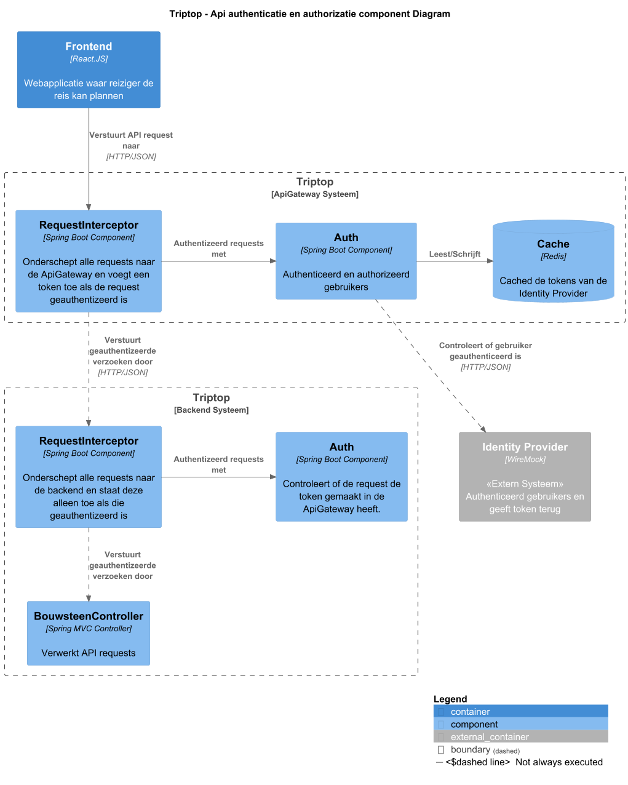

# Software Guidebook Triptop

## 1. Introduction
Dit software guidebook geeft een overzicht van de Triptop-applicatie. Het bevat een samenvatting van het volgende: 
1. De vereisten, beperkingen en principes. 
1. De software-architectuur, met inbegrip van de technologiekeuzes op hoog niveau en de structuur van de software. 
1. De ontwerp- en codebeslissingen die zijn genomen om de software te realiseren.
1. De architectuur van de infrastructuur en hoe de software kan worden geinstalleerd. 

## 2. Context

> [!IMPORTANT]
> Werk zelf dit hoofdstuk uit met context diagrammen en een beschrijving van de context van de software.

Toelichting op de context van de software inclusief System Context Diagram:
* Functionaliteit
* Gebruikers
* Externe systemen

## 3. Functional Overview

Om de belangrijkste features toe te lichten zijn er user stories en twee domain stories gemaakt en een overzicht van het domein in de vorm van een domeinmodel. Op deze plek staat typisch een user story map maar die ontbreekt in dit voorbeeld.

### 3.1 User Stories

#### 3.1.1 User Story 1: Reis plannen

Als gebruiker wil ik een zelfstandig op basis van diverse variabelen (bouwstenen) een reis kunnen plannen op basis van mijn reisvoorkeuren (wel/niet duurzaam reizen, budget/prijsklasse, 's nachts reizen of overdag etc.) zodat ik op vakantie kan gaan zonder dat hiervoor een reisbureau benodigd is.

#### 3.1.2 User Story 2: Reis boeken

Als gebruiker wil ik een geplande reis als geheel of per variabele (bouwsteen) boeken en betalen zodat ik op vakantie kan gaan zonder dat hiervoor een reisbureau benodigd is.

#### 3.1.3 User Story 3: Reis cancelen

Als gebruiker wil ik een geboekte reis, of delen daarvan, kunnen annuleren zodat ik mijn geld terug kan krijgen zonder inmenging van een intermediair zoals een reisbureau.

#### 3.1.4 User Story 4: Reisstatus bewaren 

Als gebruiker wil ik mijn reisstatus kunnen bewaren zonder dat ik een extra account hoef aan te maken zodat ik mijn reis kan volgen zonder dat ik daarvoor extra handelingen moet verrichten.

#### 3.1.5 User Story 5: Bouwstenen flexibel uitbreiden

Als gebruiker wil ik de bouwstenen van mijn reis flexibel kunnen uitbreiden met een zelf te managen stap (bijv. met providers die niet standaard worden aangeboden zoals een andere reisorganisatie, hotelketen etc.) zodat ik mijn reis helemaal kan aanpassen aan mijn wensen.

### 3.2 Domain Story Reis Boeken (AS IS)


### 3.3 Domain Story Reis Boeken (TO BE)


### 3.4 Domain Model


## 4. Quality Attributes

Voordat deze casusomschrijving tot stand kwam, heeft de opdrachtgever de volgende ISO 25010 kwaliteitsattributen benoemd als belangrijk:
* Compatibility -> Interoperability (Degree to which a system, product or component can exchange information with other products and mutually use the information that has been exchanged)
* Reliability -> Fault Tolerance (Degree to which a system or component operates as intended despite the presence of hardware or software faults)
* Maintainability -> Modularity (Degree to which a system or computer program is composed of discrete components such that a change to one component has minimal impact on other components)
* Maintainability -> Modifiability (Degree to which a product or system can be effectively and efficiently modified without introducing defects or degrading existing product quality)
* Security -> Integrity (Degree to which a system, product or component ensures that the state of its system and data are protected from unauthorized modification or deletion either by malicious action or computer error)
* Security -> Confidentiality (Degree to which a system, product or component ensures that data are accessible only to those authorized to have access)

## 5. Constraints

> [!IMPORTANT]
> Beschrijf zelf de beperkingen die op voorhand bekend zijn die invloed hebben op keuzes die wel of niet gemaakt kunnen of mogen worden.

## 6. Principles

> [!IMPORTANT]
> Beschrijf zelf de belangrijkste architecturele en design principes die zijn toegepast in de software.

> Open/Closed Principle

Dit principe is toegepast zodat er gemakkelijk nieuwe APIs of authenticatie vormen toegevoegd kunnen worden.
Het is belangrijk om dit principe te volgen omdat dan al bestaande code niet veranderd hoeft te worden om de toevoegingen te kunnen doen.

> Program to an Interface

Dit principe is toegepast zodat code niet afhankelijk is van concrete implementaties maar van abstracties.
Het is belangrijk om dit toe te passen zodat er nieuwe implementaties toegevoegd of vervangen kunnen worden.

## 7. Software Architecture

###     7.1. Containers

> [!IMPORTANT]
> Voeg toe: Container Diagram plus een Dynamic Diagram van een aantal scenario's inclusief begeleidende tekst.

###     7.2. Components

> [!IMPORTANT]
> Voeg toe: Component Diagram plus een Dynamic Diagram van een aantal scenario's inclusief begeleidende tekst.

#### Api authenticatie en authorizatie

Het component diagram over hoe er voor gezorgd wordt dat authenticatie en authorisatie consistent worden toegepast bij het communiceren met verschillende externe APIs staat hieronder.
Dit is geinterpreteerd als dat gebruikers geauthenticeerd en geauthorizeerd moeten zijn voor de specifieke requests die ze willen maken.

Hiervoor wordt gebruik gemaakt van een aparte ApiGateway die daarin alle requests authenticeerd en authorizeerd.
Het Auth component zal verantwoordelijk zijn voor het bekijken wat voor type request er gedaan wordt en of de gebruiker die mag maken.

Als het Auth component de request toestaat zal de RequestInterceptor een extra token toevoegen die gebruikt zal worden door de backend om te valideren dat de request via de Api Gateway gemaakt is.
Daarna stuurd de RequestInterceptor de request door naar de backend.

De backend heeft zijn eigen RequestInterceptor en Auth componenten die samen van alle requests valideren dat ze gemaakt zijn via de Api Gateway.



###     7.3. Design & Code

> [!IMPORTANT]
> Voeg toe: Per ontwerpvraag een Class Diagram plus een Sequence Diagram van een aantal scenario's inclusief begeleidende tekst.


#### Strategy en factory voor api auth

Voor het authenticeren en authorizeren van alle requests naar de API is ervoor gekozen om de Strategy en Factory patterns in combinatie te gebruiken.
Hiervoor is gekozen omdat er op deze manier gemakkelijk een nieuwe authenticatie service toegevoegd kan worden.
Ook kan de frontend dan doorgeven welke authenticatie service gebruikt moet worden.

In het volgende klassendiagram is te zien hoe de twee patterns gebruikt worden.
De InboundRequestFilter gebruikt de AuthStrategyFactory om een IAuthStrategy te maken.
IAuthStrategy is een interface met een methode `authenticate` die geimplementeerd wordt door specifieke AuthStrategies zoals bijvoord MockLocalAuthStrategy.


In het sequentie diagram hieronder is te zien hoe de API Gateway te werk gaat.
De API Gateway krijgt een willekeurige HTTP Request en haalt als eerste alle headers uit de request.
Dan authenticeerd het de request door de headers mee te geven aan de authenticate methode.
Indien de request geauthenticeerd is wordt de request doorverstuurd naar de backend.
Anders wordt er een 401 Unauthorized response teruggestuurd.


## 8. Architectural Decision Records

> [!IMPORTANT]
> Voeg toe: 3 tot 5 ADR's die beslissingen beschrijven die zijn genomen tijdens het ontwerpen en bouwen van de software.

### 8.4. ADR-004 Gateway Security

Datum: 2025-03-27

#### Context

De applicatie moet beveiligd worden. Op alle requests moeten tokens aanwezig zijn en geverifieerd worden. Er hoeft enkel
gekeken te worden of de gebruiker geauthorizeerd is, verder moeten geen acties ondernomen worden.

#### Considered Options

| Forces                                 | Spring Security | Spring Boot Filters | ClientHttpRequestInterceptor |
|----------------------------------------|-----------------|---------------------|------------------------------|
| Moet incoming requests kunnen filteren | ++              | ++                  | --                           |
| Moet eenvoudig zijn                    | -               | ++                  | +                            |
| Staat custom filters toe               | ++              | ++                  | ++                           |    

#### Decision

We kiezen voor Spring Boot Filters omdat dit een envoudige manier is om een filter uit te voeren op alle requests. Omdat
het voor ons enorm belangrijk is dat het eenvoudig is en we geen extra acties moeten ondernemen, daarom is de extra
complexiteit van Spring Security ongewenst.

#### Status

Accepted

Superceded by [8. Use Spring Cloud Gateway for gateway](../doc/architecture/decisions/0008-use-spring-cloud-gateway-for-gateway.md)


#### Consequences

- We kunnen eenvoudig nieuwe filters toevoegen.
- We moeten Spring Boot gebruiken.

### 8.7. ADR-007 Gebruik van Spring Cloud Gateway voor gateway

Datum: 2025-03-31

#### Context

Om te zorgen dat alle requests via de gateway doorgaan naar de backend server wanneer ze door alle filters gaan moet er
een technology gebruikt worden voor het doorsturen van requests.

#### Considered Options

| Forces        | Maak de doorstuur technology zelf | Spring Cloud Gateway |
|---------------|-----------------------------------|----------------------|
| Complexiteit  | ?                                 | ++                   |
| Onderhoud     | --                                | ++                   |
| Performance   | ?                                 | +                    |
| Flexibiliteit | ?                                 | ++                   |

#### Decision

We kiezen om Spring Cloud Gateway te gebruiken, omdat het biedt wat nodig is en in het Spring
ecosysteem zit, waar de rest van de TripTop applicatie ook mee gemaakt wordt.

#### Status

Accepted

Supercedes [5. gateway security](../doc/architecture/decisions/0005-gateway-security.md)

#### Consequences

Consequentie hiervoor is dat er geen gebruik gemaakt kan worden van de Filter interface van Spring Boot Web, maar er moet
gebruik gemaakt worden van de GlobalFilter en Ordered interfaces van Spring Cloud Gateway.
Het is makkelijk om te wisselen naar een nieuwe server, omdat er maar op een plek het URL domein gebruikt wordt.
Het is makkelijk om te wisselen naar een microservice structuur met meerdere kleine servers.

### 8.8. ADR-008 Strategy design pattern voor authenticatie

Datum: 2025-03-31

#### Context

In het prototype is gebruik gemaakt van de Strategy en Factory Method patterns.
In code ziet het er als volgt uit:

```java
AuthStrategy authStrategy = authStrategyFactory.getStrategy(parameterMap.get("auth-type"));
boolean isAuthenticated = false;
isAuthenticated = authStrategy.authenticate(parameterMap);
```

```java

@Component
public class AuthStrategyFactory {
    private final RestTemplate restTemplate = new RestTemplate();

    public AuthStrategy getStrategy(String authType) {
        return switch (authType) {
            case "mock" -> new MockAuthStrategy(restTemplate);
            case "google" -> new GoogleMockAuthStrategy(restTemplate);
            default -> throw new IllegalArgumentException("Unknown auth type: " + authType);
        };
    }
}
```

```java
public abstract class AuthStrategy {
    protected final RestTemplate restTemplate;
    protected final String authApiLink;
    protected final String strategyName;

    protected AuthStrategy(RestTemplate restTemplate, String authApiLink, String strategyName) {
        this.restTemplate = restTemplate;
        this.authApiLink = authApiLink;
        this.strategyName = strategyName;
    }

    public abstract boolean authenticate(Map<String, String> requestParams);
}
```

#### Considered Options

| Forces                                            | Strategy ja | Strategy nee | Factory ja | Factory nee |
|---------------------------------------------------|-------------|--------------|------------|-------------|
| Frontend kan authenticatie methode bepalen        | ++          | --           | ++         | ++          |
| Backend code volgt single responsiblity principle | ++          | --           | ++         | --          |

#### Decision

Dit werkt goed en staat gemakkelijk toe om nieuwe authenticatie strategien toe te voegen. Ook kan de frontend bepalen
welke strategy gebruikt moet worden. De frontend weet dit omdat het inloggen met de Identity Provider direct vanaf de
frontend gebeurt.

#### Status

Accepted

#### Consequences

Het is makkelijk om nieuwe inlog-mogelijkheden toe te voegen.
Er moet altijd een inlog-strategy gebruikt worden.
Er moet samengewerkt worden vanuit de frontend en backend voor de namen van de headers.


## 9. Deployment, Operation and Support

> [!TIP]
> Zelf beschrijven van wat je moet doen om de software te installeren en te kunnen runnen.